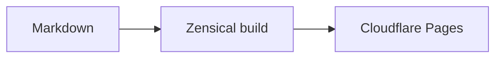

# Writing a knowledge base

A Glassdocs knowledge base is Markdown, full stop: pages in `docs/*.md` plus one `mkdocs.yml` at the repo root. You write plain Markdown files, push to `main`, and the publisher builds them with Zensical (the MkDocs successor from the Material team) and deploys the result. This page covers the Markdown-only rule, the template repo structure, the Markdown features you can use, navigation, and how to write pages that read well.

## The Markdown-only rule

Everything a reader sees comes from Markdown. No custom HTML pages, no forked themes, no build scripts. The one stylesheet in your repo is the template's own `docs/stylesheets/extra.css`, which carries brand tokens; you don't add others.

Why this is a hard rule and not a style preference:

- **Your content stays portable.** A folder of Markdown files diffs cleanly, reviews cleanly in pull requests, and would still be readable if you walked away from Glassdocs tomorrow.
- **Publishing is centralized.** Build tooling, security headers, and content checks are maintained in the [publisher](how-it-works.md) and run at deploy time. Your repo never accumulates publishing machinery that drifts out of date.
- **The pipeline enforces the shape.** The publisher runs a compliance lint on every deploy before anything else happens: `mkdocs.yml` must exist, tracked HTML under `docs/` fails the build, and commercial filenames are blocked. The rest of the rule (no forked themes, no build scripts) is convention rather than enforcement, but it is what keeps the guarantees above true.
- **Pages map back to source.** At deploy time the publisher injects metadata linking each published page to its Markdown file, which is what lets the [browser extension](extension.md) recognize your site and edit the right file.

The only non-content file your repo carries is `.github/workflows/deploy.yml`, which has to live in its standard location to trigger CI. See [Publishing](publishing.md) for what it does.

!!! warning "No commercial content in project KBs"
    Statements of work, rate cards, pricing, quotes, invoices, and contracts do not belong in a project knowledge base. Project KBs are for technical documentation, architecture, and project knowledge. The compliance lint blocks filenames matching `sow`, `rate-card`, `pricing`, `quote`, `invoice`, or `contract` (as `.md`, `.pdf`, or `.docx` under `docs/`) unless the deploy explicitly opts in with `allow-financial: true`, which is intended only for dedicated pre-sales KBs. Effort-only artefacts like `proposal.md`, `estimate.md`, and `plan.md` are deliberately exempt: work breakdowns and dev-day estimates are project planning, not commerce.

## Template structure

New KBs start from the template repo at [github.com/Glassdocs/kb-template](https://github.com/Glassdocs/kb-template). A fresh instance looks like this:

| Path | What it is |
| --- | --- |
| `docs/index.md` | Your home page |
| `docs/getting-started.md` | A starter page to replace or extend |
| `docs/assets/` | Logo, favicon, and the Mermaid init script |
| `docs/stylesheets/extra.css` | Theme accent styling, referenced from `mkdocs.yml` |
| `mkdocs.yml` | Site config: name, theme, Markdown features, navigation |
| `.github/workflows/deploy.yml` | Calls the reusable publisher on push to `main` |
| `requirements.txt` | Pins the Zensical build (optional; the publisher installs Zensical if absent) |

To start, customize two things in `mkdocs.yml`: `site_name` and `nav`. The rest of the config works as shipped, and Zensical reads it unchanged.

## Supported Markdown features

The template's `mkdocs.yml` enables a full set of Markdown extensions. Beyond standard Markdown you get tables, footnotes, definition lists, abbreviations, attribute lists, and permalinked headings, plus the features below.

### Admonitions

Call out notes, tips, and warnings:

```markdown
!!! note "Optional title"
    Body of the admonition, indented four spaces.

!!! warning
    Uses the type name as the title when none is given.
```

The `pymdownx.details` extension also gives you collapsible blocks. Start with `???` instead of `!!!` and the block renders collapsed:

```markdown
??? info "Click to expand"
    Hidden until the reader opens it.
```

### Mermaid diagrams

Fence a diagram with the `mermaid` language and it renders as a diagram, not a code block:

````markdown

````

### Content tabs

Group alternatives (per-OS instructions, per-language examples) into tabs:

```markdown
=== "macOS"
    Instructions for macOS.

=== "Windows"
    Instructions for Windows.
```

### Task lists

Checklists render with real checkboxes:

```markdown
- [x] Repo created from the template
- [x] First page written
- [ ] Deployed
```

### Code blocks

Fenced code blocks get syntax highlighting, and every block has a copy button. Inline highlighting works too, so `` `#!python range(10)` `` renders highlighted inline code. Use inline code for file names, commands, and variables.

## Navigation

The sidebar is defined by `nav` in `mkdocs.yml`:

```yaml
nav:
  - Home: index.md
  - Getting Started: getting-started.md
  - Architecture: architecture.md
```

When you add a page, add it to `nav` in the same commit. Keep labels short (one or two words) and order pages the way a new reader should meet them. The per-page table of contents is generated automatically from your headings, so within a page, headings are your navigation: one `#` title per page, `##` for sections, `###` for subsections, and never skip a level.

## Writing well

### What every KB should cover

| Section | Purpose | Required |
| --- | --- | --- |
| About / Overview | What the project is and who it's for | Yes |
| Getting Started | Setup, prerequisites, first run | Yes |
| Tech Stack | Technologies used, in a table | Yes |
| Architecture | System design, key decisions | Recommended |
| API / Data Model | Endpoints, schemas, data flow | If applicable |
| Deployment | How and where it deploys | Recommended |

Add project-specific sections as needed.

### Voice and tone

- **Clear over clever.** Write for scanning, not studying.
- **Direct.** Lead with what matters and skip filler.
- **Friendly but professional.** Approachable, not casual.
- **Confident.** State things plainly. Avoid hedging with "maybe", "probably", "it should".
- Prefer a list to a long paragraph, use descriptive link text (never "click here"), and keep list items parallel in structure.

### Don't publish text that reads machine-made

AI tools are a normal part of the workflow. Publishing text that reads like raw model output is the problem. The rules:

1. **Avoid em dashes in running text.** Almost every one can become a full stop, colon, semicolon, comma, or parentheses. One on a page is fine; five is a pattern.
2. **En dashes only in ranges**, like 2024–2026 or 10–15 hours. Never as sentence punctuation.
3. **Vary sentence rhythm.** If every paragraph follows the same shape ("X is not Y. It is Z."), rewrite some.
4. **Use real, specific examples** from the product instead of plausible generic ones.
5. **Use descriptive headings** specific to the content. "How BLE discovery works" beats "Technical Overview". When every page is organized into "Key Takeaways" and "Why This Matters", it feels templated.
6. **Don't over-polish.** A doc that reads like a real person wrote it in a real afternoon is more trustworthy than one sanded to a uniform finish.

Before publishing a page, read it and ask: could a reader tell it was AI-assisted just from the style? Do more than two em dashes appear? Does every paragraph follow the same structure? Would it sound natural read aloud to a colleague? If any answer is wrong, edit it down.

## Next steps

- [Publish the KB](publishing.md) once you have pages worth reading.
- [Install the extension](extension.md) to edit pages directly from the published site.
- New here? Start with [Getting Started](getting-started.md).
