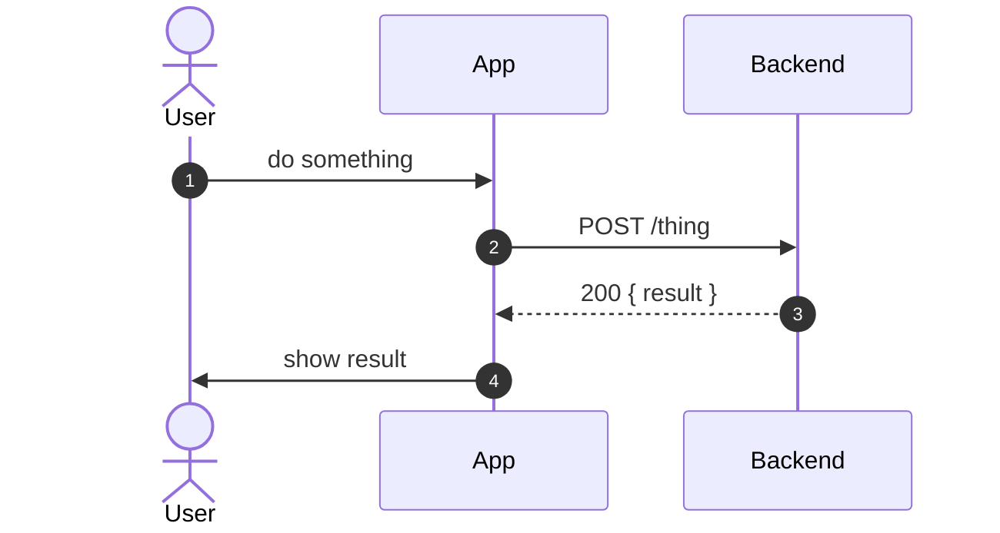
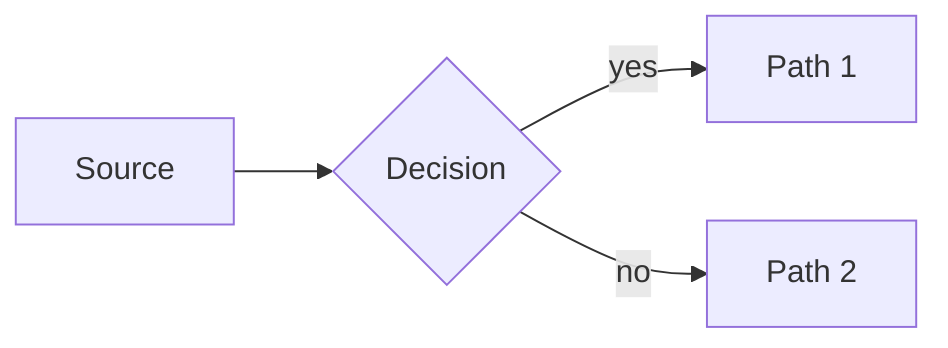

# Getting Started

This page is a live cheat-sheet for the authoring conventions. Copy from it.

## Text

Standard Markdown: **bold**, *italic*, `inline code`, [links](index.md), and lists.

## Admonitions

!!! tip "Use admonitions for callouts"
    `!!! note`, `!!! tip`, `!!! warning`, `!!! danger`, `!!! success`. They render as coloured boxes.

## Tables

| Item | Owner | Status |
| --- | --- | --- |
| Example row | RL | In progress |
| Another row | Client | Done |

## Cards

For richer callouts, use the brand card components (styled in `extra.css`):

<div class="card highlight" markdown="1">
A **highlight card** for the key takeaway on a page.
</div>

<div class="grid-2" markdown="1">
<div class="card" markdown="1">
**Card A** — side-by-side content.
</div>
<div class="card" markdown="1">
**Card B** — the second column.
</div>
</div>

## Diagrams (Mermaid)

Author diagrams as **Mermaid** text — an agent edits a step in one line, and it renders to crisp, zoomable vector SVG. Sequence, flowchart, state, ER, and more.





!!! warning "Mermaid gotcha"
    Don't use semicolons (`;`) inside a Mermaid `Note` or label — Mermaid treats `;` as a statement separator. Use `·` or a comma.

## Code

```bash
zensical serve   # live preview
zensical build   # output to ./site
```
