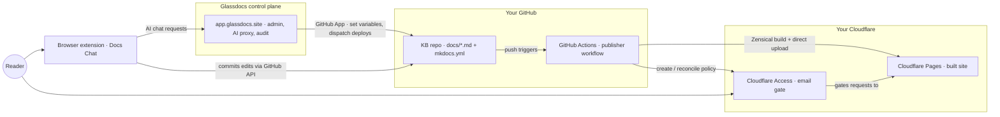

# How it works

Glassdocs is a **zero-data control plane**: it orchestrates repos, deploys, access, and AI — but your content, your published sites, and your compute all stay in your own GitHub and Cloudflare accounts. This page walks through the components, how they connect, and the design decisions that keep your documents out of Glassdocs' hands.

## The components

| Component | Where it runs | What it does |
|---|---|---|
| **KB repo** | Your GitHub org | The source of truth: `docs/*.md` pages and `mkdocs.yml` (nav + theme). Created by you from the [kb-template](https://github.com/Glassdocs/kb-template/generate). |
| **Publisher workflow** | Your GitHub Actions | The reusable deploy workflow shipped with the template. Builds the KB with **Zensical** and deploys to Cloudflare Pages, with fail-closed access gating. |
| **Cloudflare Pages + Access** | Your Cloudflare account | Hosts the built site at `<project>.pages.dev`; Cloudflare Access gates every request behind an email-based policy. |
| **Managed backend** | [app.glassdocs.site](https://app.glassdocs.site) | The control plane: admin console, GitHub App integration, AI proxy, usage metering, audit log. Holds identity and tokens — never content. |
| **Browser extension** | The reader's browser | Docs Chat: an AI side panel on published pages for asking questions and proposing edits back to the source repo. |

## Control plane vs data plane

The central design decision is what Glassdocs does **not** do: host customer data.

| State | Lives in |
|---|---|
| KB content (`docs/*.md`), nav + theme (`mkdocs.yml`), branding assets | **Your GitHub repo** — Glassdocs never copies it; page bodies only *transit* the control plane during edits, never land in it |
| Published site | **Your Cloudflare Pages** — deployed by your own CI |
| Access policy (who can read the site) | **Your repo's Actions variables → Cloudflare Access** — reconciled by the deploy workflow |
| GitHub App installation | **Your GitHub org** — revocation = uninstall |
| Identity (tenant, seats), encrypted org AI key | Glassdocs database |
| Usage/budget counters (token **counts** only) | Glassdocs database |
| KB inventory index + audit log | Glassdocs database — the inventory is regenerable from GitHub; the audit log is the one genuinely control-plane-owned record |

**Glassdocs never stores document content, prompts, or model responses.**

## How the pieces connect



## Publishing: your CI, fail-closed

When you push to the KB repo (or trigger a redeploy from the admin), the publisher workflow runs **in your GitHub Actions with your Cloudflare credentials**. It builds the Markdown with Zensical into a static site and deploys it by direct upload to your Cloudflare Pages project. Five invariants are enforced on every deploy:

1. **Fail-closed on first deploy** — if the Cloudflare Access app can't be created, the workflow aborts *before* publishing any content.
2. **Pre-flight block** — if the domain is already publicly reachable (HTTP 2xx), the deploy fails: the gate isn't active.
3. **Post-deploy verify-or-rollback** — after deploying, the workflow probes the site again; if it's public, the deployment is deleted, re-probed, and escalated until the exposure is actually closed. It never reports success on an open site.
4. **Independent policy verification** — every deploy re-derives the expected Access policy from its inputs and compares it to the live policy; any mismatch (a manual dashboard edit, a sync bug) fails the deploy.
5. **Preview deployments disabled** — no per-branch preview URLs that could bypass the gate.

!!! tip "A broken deploy is better than a public deploy"
    These invariants are the difference between "private KB" and "a client's confidential docs exposed publicly". They are non-negotiable and verified independently on every run. See [Publishing](publishing.md) and [Security](security.md).

## Access: policy lives in your repo, not in Glassdocs

Who can read a site is expressed as **GitHub Actions variables on your repo** — a staff SSO domain, optional client domain, and optional individual client emails, plus the Pages project name. The deploy workflow reads these and reconciles the Cloudflare Access policy to match.

There is **no default**: a variable left unset grants no one through that channel, so a KB with no access set deploys locked to nobody. The admin console edits these variables through the GitHub App and triggers a redeploy — Glassdocs holds no separate access list that could drift or leak. An explicit revoke (clearing a field) is distinguished from a typo: a malformed value is rejected up front rather than silently clearing access.

When a reader visits the site, Cloudflare's edge checks for a valid Access session before any content is served. Without one, the reader is redirected to the Cloudflare Access login and must authenticate with an email the policy allows; a signed session cookie then lets requests through for the session's duration. See [Hosting](hosting.md).

## Identity: one GitHub App, two token modes

A single Glassdocs GitHub App covers both directions of trust:

- **User-to-server (device flow)** — the extension signs each user in with their own GitHub identity. Tokens live in the browser's extension storage, never server-side; refresh, expiry, and revocation are handled transparently. Edits are committed as the actual person, not a shared bot.
- **Installation tokens** — for control-plane actions on your repos (setting variables, dispatching deploys, the in-console editor). The backend mints a short-lived (1-hour) installation token scoped to your org, and every admin route verifies the caller is an admin of that org **before** minting one.

You install the App on your org and select repos. The permission footprint is deliberately small — contents read plus Actions write; no repo-creation or administration scope. Glassdocs stores only the installation record; uninstalling the App revokes everything. See [Admin](admin.md).

## Editing: two paths, both passthrough

There are two ways to edit a KB, and both preserve the zero-data invariant because content only transits, never persists:

- **The browser extension** (chat-to-edit, the power surface) — commits straight to your repo with the signed-in user's own GitHub token.
- **The in-console editor** — a browser-only path in the admin so someone can edit without installing anything. It reads and writes `docs/*.md` through a thin server proxy using a short-lived, org-scoped installation token. The page body is read from and committed back to your default branch (which republishes on push); the server persists nothing — the audit record holds the file path and byte count only, never content. Unsaved edits live in the browser, never in a server-side draft store.

Both paths share the same AI core. Key resolution is identical: your org's **BYO key** if configured (your model, you pay), otherwise the **free tier** (Glassdocs' key, fair-use caps). Only token *counts* are metered; the prompt and completion are never stored. AI output is previewed and only enters the page on an explicit apply — and only reaches GitHub when a human saves. See [Enterprise](enterprise.md) for BYO keys and the [API](api.md) for the programmatic surface.

## How a site opts in: the `source-repo` meta tag

The extension needs to know which repo a published page came from. A site opts in by emitting a single meta tag in every published page's rendered HTML:

```html
<meta name="source-repo" content="owner/repo">
```

(`docs-repo` is still accepted as a legacy alias.) The tag must be present in every page's head for the extension to recognize the site. Repo detection is **only** via this tag — setting the GitHub repo's website/homepage field does nothing.

This is the whole integration surface: no SDK, no embedded script, no tracking pixel. A site that doesn't emit the tag is invisible to the extension; a site that does gets chat and edit for any signed-in reader with repo access. See the [Extension guide](extension.md).

## Trust boundaries in one paragraph

Tenant isolation is delegated to boundaries that are already battle-tested: GitHub App installation scope on the GitHub side, and account boundaries on the Cloudflare side — not a hand-rolled ACL. Tokens are short-lived where possible; anything persisted (like a BYO AI key) is encrypted at rest, with plaintext never logged. Every mutating control-plane action lands in an append-only audit log. The full threat model is covered in [Security](security.md).
